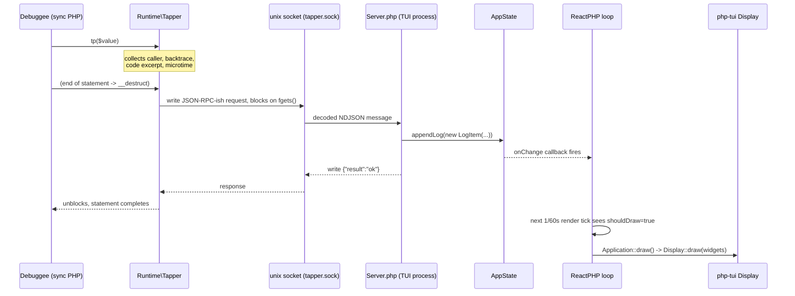

# Architecture

## Two processes

Tapper is always at least two OS processes talking over a local unix socket:

1. **The debuggee** — any ordinary PHP script/app that calls the global `tp()` helper (`src/helpers.php`). Fully synchronous. One `tp()` call = one blocking socket round-trip.
2. **The TUI** — `bin/tapper`, a long-running process built on the ReactPHP event loop, rendering with `php-tui`. Fully async; nothing in this process should ever block.

There can be many debuggee processes talking to one running TUI. The TUI process owns the socket file and is the server; every debuggee is a client, despite "server" (`src/Server.php`) living in the same package as the "client" (`src/Rpc/JsonRpcClient.php`) — don't let the class names imply which process they run in without checking.

## Inside the TUI process

### Boot (`bin/tapper` → `src/Console/main.php` → `Application::run()`)

`main.php` builds a `php-di` `ContainerBuilder` with autowiring and attribute support enabled, registers a handful of framework objects (`Terminal`, `PhpTermBackend`, `Display`, ReactPHP `LoopInterface`) as factories, and resolves `Application` out of the container. Every other class in `Console/*` is constructor-injected — there is no manual wiring beyond `main.php`.

`Application::run()`:
1. Puts the terminal into raw/alternate-screen/mouse-capture mode.
2. Builds the component tree (`Main`, `Popup`) via the container.
3. Registers two `ReactPHP` periodic timers: a resize poll (`RESIZE_RATE = 1/4`s) and a render tick (`RENDER_RATE = 1/60`s, gated by a `shouldDraw` dirty flag).
4. Wires stdin into the event parser and dispatches parsed key/mouse events onto `EventBus`.
5. Starts `Server::run()` (opens the unix socket listener) and then calls `$this->loop->run()`, which blocks until the loop is stopped.

**Known wart:** `Application::run()` registers `SIGINT`/`SIGTERM` handlers *after* `$this->loop->run()` — since `loop->run()` blocks, those two `addSignal` calls never execute until the loop has already stopped, making them dead code. See `known-issues.md`.

### Render loop

Rendering is pull-based and coarse-grained: nothing re-renders incrementally per component. Every render tick (when dirty), `Application::draw()` calls `$this->window->render($area)` on the root `Main` component, which recursively calls `render()`/`view()` on its children and returns one big composed `Widget` tree, handed to `php-tui`'s `Display::draw()`. There is no diffing — `php-tui` and the terminal backend handle only drawing the frame, not minimizing writes at the Tapper level.

The dirty flag (`shouldDraw`) is set from exactly two places: `AppState::setOnChange()` (any state mutation) and the resize-poll timer noticing the terminal size changed.

### Input handling

Raw stdin bytes are parsed by `php-tui/term`'s `EventParser` into typed events (`CharKeyEvent`, `CodedKeyEvent`, `MouseEvent`, ...). `Application::handleEvent()` forwards the supported event types onto `EventBus::emit()`. A second path, `handleEventInTypingMode()`, exists for a not-yet-fully-used "typing mode" on `AppState` that redirects character input differently (used for the pause/`wait()` continue flow scaffolding — not deeply exercised yet).

See [`console-framework.md`](console-framework.md) for how components subscribe to these events.

## Outside the TUI process

### `tp()` client path

`src/helpers.php` exposes the global `tp($value)`, which constructs `Runtime\Tapper` and calls `->tap($value)`. `Runtime\Tapper::__construct()` immediately walks `debug_backtrace()` to capture caller file/line and a small source-code excerpt around that line (`getCodeExcerpt()`), and resolves the project root via the Composer `ClassLoader`'s own file location (`findProjectRoot()` — brittle if Composer's install layout changes, but currently the only signal available).

The actual network send happens in `__destruct()`, not in `tap()` — this means a `tp($value)` call sends *after* the full statement completes (e.g. `tp('x')->wait()` sends once, when the temporary `Tapper` object is destroyed at the end of the statement). `wait()` just changes `$this->type` from `'log'` to `'wait'` before send.

### Transport (`Rpc/*`)

`Runtime\Tapper::send()` builds a `Rpc\JsonRpcRequest` (method + params) and calls `JsonRpcClient::call()`, which opens a **blocking** `stream_socket_client()` connection, writes one line of JSON, and blocks on `fgets()` for the reply (up to `pauseTimeout`, 3600s by default — long enough to support `wait()` pausing indefinitely for a user to press Enter in the TUI). See [`rpc-protocol.md`](rpc-protocol.md) for the wire format and a live bug in this path.

### Server (`Server.php`, runs inside the TUI process)

Listens on a unix socket (`SocketServer('unix://' . $socketPath)`), decodes newline-delimited JSON (`clue/ndjson-react`) per connection, and switches on `method`:
- `log` → builds a `State\LogItem` and calls `AppState::appendLog()`, replies `{"result":"ok"}`.
- `wait` → builds a `State\LogItem` with a "paused" message, then instead of replying immediately, registers a **one-shot-ish** `EventBus::listen(KeyCode::Enter, ...)` closure that writes the reply whenever Enter is next pressed anywhere in the TUI. (Note: this listener is never removed — see `known-issues.md` for the implication if multiple `wait()` calls are in flight.)
- anything else → JSON-RPC style `-32601` "method not found" error.

## Directory-to-responsibility map

| Path | Responsibility |
|---|---|
| `src/helpers.php`, `src/Runtime/` | Public API surface used by debuggee apps (`tp()`) |
| `src/Rpc/` | Wire types + blocking client used by `Runtime\Tapper` |
| `src/Server.php` | TUI-side socket listener, the only writer to `AppState` from outside `Console/` |
| `src/Console/State/` | The single source of UI truth (`AppState`) and its value objects |
| `src/Console/*Attributes/` | Declarative event-binding attributes, consumed by `Component` |
| `src/Console/Component.php`, `Windows/`, `Components/` | The component tree and its rendering |
| `src/Console/EventBus.php` | Cross-cutting pub/sub for key/mouse/custom events |
| `src/Console/Support/` | Pure logic extracted out of components (currently just `Scroll`) |